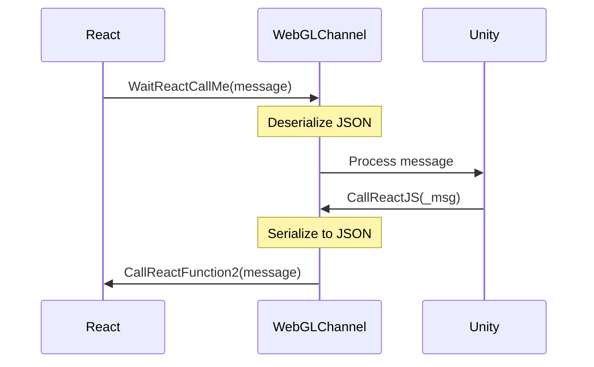

# WebGLChannel

# WebGLChannel Class

The WebGLChannel class is a MonoBehaviour that facilitates communication between Unity and React in a WebGL context.

## Key Features:

- Implements DontDestroyOnLoad to persist across scene changes
- Provides methods for bidirectional communication between Unity and React
- Uses JSON serialization for data exchange

## Important Methods:

### WaitReactCallMe(string message)

This method is called by React to send messages to Unity. It deserializes the incoming JSON message into a SigmaUnityChannelProto object and processes it.

### CallReactJS(string _msg)

A static method that sends messages from Unity to React. It's conditionally compiled for WebGL builds and uses the CallReactFunction2 method to communicate with React.

## External Method:

`[DllImport("__Internal")]
private static extern void CallReactFunction2(string message);`
This external method is used to call JavaScript functions from Unity in WebGL builds.

# SigmaUnityChannelProto Class

The SigmaUnityChannelProto class is a serializable class that defines the structure for messages exchanged between Unity and React.

## Properties:

- Act: A string representing the action or message type
- Req: A Dictionary<string, object> for storing request data
- Resp: A string for storing response data

## Methods:

### EncodeJson()

Serializes the SigmaUnityChannelProto object into a JSON string. It creates a new dictionary with 'act' and 'req' fields, where 'req' is serialized separately.

### DecodcJson()

Deserializes the Resp string based on the Act property. It handles different message types:

- "`wallet_info`": Deserializes into a WalletStream object and updates ChainsData
- "`all_my_cybors`": Deserializes into a Dictionary<long, CyborNFTStream> and updates ChainsData
Returns the deserialized object or null for unhandled message types.

## Note:

The code includes TODO comments for encrypting the Req property and decrypting the Resp property, which should be implemented for secure communication.

This basic timing graph illustrates the communication flow between React, WebGLChannel, and Unity based on the information provided about the WebGLChannel class. You can modify this graph to include more specific timing information or additional interactions as needed.