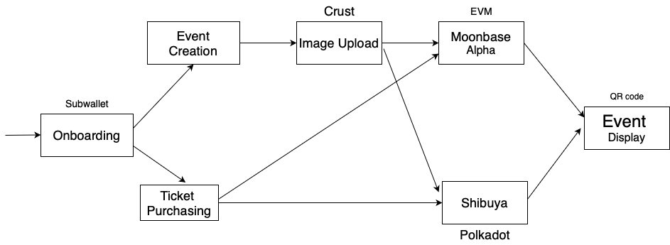

### Basic Information
   Project name: BlockPass

   Project approval date (month and year): August 2024

### Logo

## 🏗️ BlockPass — Decentralized Event Ticketing

**Project Overview:**

🎟️ Introducing BlockPass - Revolutionizing Event Ticketing with Blockchain: In a world where event ticket scalping, price manipulation, and counterfeit tickets plague the industry, BlockPass emerges as a beacon of innovation and trust. Leveraging the power of blockchain technology, BlockPass aims to solve the major problem of pricing transparency and fairness within the event ticketing ecosystem.

**Problem Statement:**  
The traditional event ticketing industry suffers from various challenges, including unfair ticket pricing, lack of transparency, and counterfeit ticketing. These issues often lead to frustrated fans, inflated ticket prices, and a lack of trust in ticketing systems.

**Solution:**  
BlockPass provides a decentralized solution to these issues by leveraging blockchain technology. Our platform ensures transparent and fair ticket pricing, prevents scalping, and guarantees the authenticity of event tickets.

**Demo**

- [Presentation](https://drive.google.com/file/d/1wKH26aZXeoojPb6QOdpKDn_tHd3-50LS/view?usp=sharing)
- [Video]()

## Project Architecture

 ## Track and Selected Bounty

 **Track**: **(Social ) Building an event ticketing system based on Polkadot SDK**
 
 ## Bounties: 
  - ### Moonbeam Integration
    - **Smart Contract Deployment:** We deployed our decentralized event ticketing smart contracts on the Moonbeam network. This allowed us to utilize Moonbeam’s Ethereum compatibility while benefiting from Polkadot's scalability and security.
    - **Cross-Chain Interoperability:** Moonbeam’s compatibility with the Ethereum Virtual Machine (EVM) enabled us to integrate seamlessly with other Ethereum-based tools and libraries, enhancing our smart contract functionality.

  - ### Crust Integration
    - **Event Banner Storage:** We used Crust Network to store event banners, ensuring that the images are securely stored in a decentralized manner. This helps in maintaining data availability and integrity.
    - **NFT Metadata Storage:** The metadata associated with event tickets, which are minted as NFTs, is stored on Crust. This ensures that the data remains immutable and accessible even if the original source is offline.

**Key Features:**

**Transparent Pricing:** Dynamic ticket pricing based on real-time market conditions.

**Fair Access:** Unique NFT-based tickets and a first-come-first-served model prevent scalpers and ensure fair access for genuine fans.

**Immutable Records:** All ticket transactions are recorded on the blockchain, creating a transparent and tamper-proof ticket ownership and sales history ledger.

**Motivation:**  
The motivation behind BlockPass stems from real-world challenges highlighted in articles like this CBC News report, which exposes the broken nature of the current event ticketing system. Instances of ticket scalping, inflated prices, and counterfeit tickets have disillusioned fans and undermined the integrity of the live entertainment industry. BlockPass aims to restore trust and fairness to event ticketing by providing a decentralized alternative that prioritizes transparency, accessibility, and authenticity.

**Impact:**  
BlockPass aims to disrupt the event ticketing industry, empowering organizers, artists, and attendees alike. By eliminating intermediaries, reducing ticket fraud, and ensuring fair pricing, we are reshaping the future of event ticketing for the better.

**Future Outlook:**  
We envision a future where event ticketing is decentralized, transparent, and accessible to all. Through continuous innovation and community collaboration, BlockPass is committed to leading the charge toward a more inclusive and equitable event ecosystem.

**Join Us:**  
Are you ready to join the revolution in event ticketing? Get involved with BlockPass today and be part of a movement that's changing the game for fans and organizers worldwide. Together, we're building a brighter future for event ticketing—one fair ticket at a time.

**Tags:**  
#BlockPass #DecentralizedTicketing #Polkadot #substrate #events #BlockchainRevolution 🎫🚀

## Team Member Profile

**Name: Teslim Ibisomi**

Role: Fullstack Developer

Relevant Experience: Teslim is a seasoned frontend developer with over 4 years of experience in building user-friendly interfaces for web applications. He specializes in HTML, CSS, JavaScript, and modern frontend frameworks such as React.js and Vue.js. He has a strong understanding of blockchain technology and has previously worked on decentralized applications (dApps) interfaces. His expertise lies in creating intuitive, responsive, and visually appealing UI/UX designs that enhance the user experience.

**Name: Abdulazeez Salihu**

Role: Backend Developer (Smart Contract Engineer)

Relevant Experience: Abdulazeez is a skilled backend developer and smart contract engineer with a solid background in blockchain development. He has extensive experience in writing, testing, and deploying smart contracts on various blockchain platforms, including Ethereum, Binance Smart Chain, and Avalanche. He is proficient in Solidity, the primary language for Ethereum smart contracts, and has a deep understanding of blockchain protocols and consensus mechanisms. He also has successfully implemented complex smart contract solutions for decentralized finance (DeFi) projects and non-fungible token (NFT) platforms.

**Name: Alade Toheeb**

Role: Full-stack Developer

Relevant Experience: Toheeb is a versatile full-stack developer with experience across both frontend and backend development. He is proficient in a wide range of programming languages and frameworks, including JavaScript, Node.js, Python, and Django. He has a keen interest in blockchain technology and has contributed to the development of several decentralized applications (dApps) from concept to deployment. His expertise in both frontend and backend development allows him to build end-to-end solutions that leverage blockchain technology to solve real-world problems.
