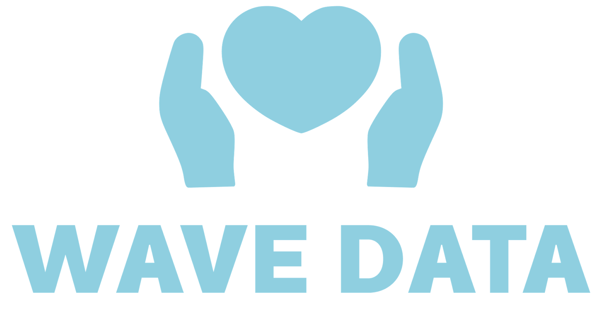
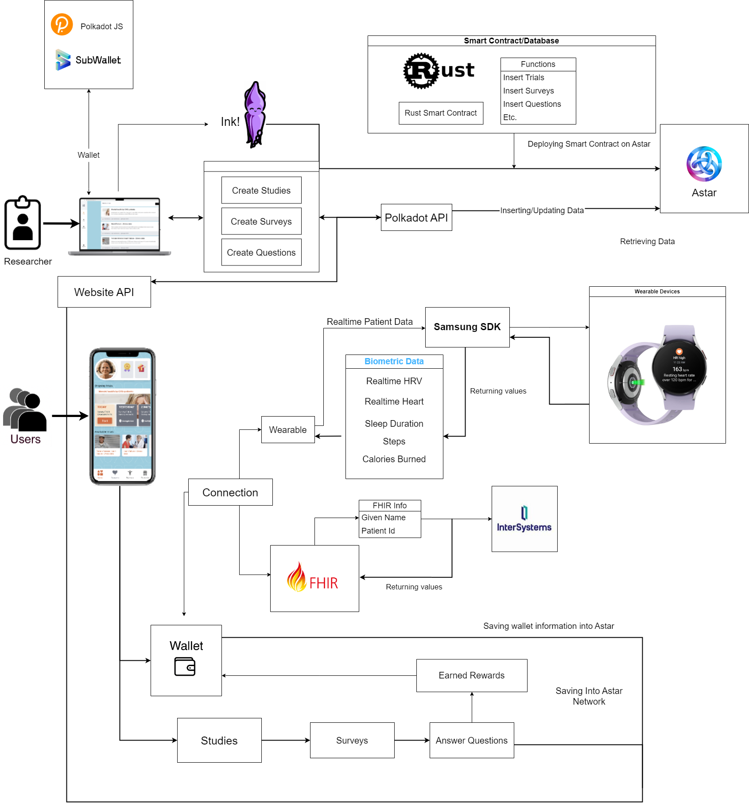

  

# WaveData

## Category
Category 4: Open topic

## Selected Bounty
### Blockchain for good - Life and Health 
- ### Life and Health
    **Goal:** Promote healthy living for everyone using blockchain technology.

    **Medical Record Management:** Blockchain can be used to store and manage medical records, ensuring data security and privacy while enhancing the efficiency of healthcare services.

    **Health Data Sharing:** Blockchain facilitates the secure sharing of health data between different medical institutions, improving the accuracy of diagnosis and treatment.

## Introduction	
### Summary:
WaveData: Decentralized marketplace for clinical trials with the power of Polkadot WaveData is based on two things: (1) Decentralized marketplace where organizations (universities/hospitals/pharma) can create a clinical trial and also get data from the people that join the clinical trial (2) App that people will use during the clinical trial, get recommendations in which trials they can participate and get credits/vouchers in their own personal wallet.

### Problem to be solved - solution
See the presentation that we made for the project: https://docs.google.com/presentation/d/17vz2zJy8KTGtGwAdNla6VPapWFxBdFhs/edit?usp=sharing&rtpof=true&sd=true

### Inspiration
In our society we see that artificial intelligence (AI) is everywhere and is already making important decisions in our daily life. AI can create many positive impacts, but we also have big challenges like racist decisions. Most things in our society are built for, and designed around, a specific “reference man." This “standard human” is usually a white male in his 30s who weighs around 155 pounds. The reference man is the default user in many parts, like cars, air-conditioned offices, city streets and especially healthcare. When it comes to healthcare, we see that it has deadly effects for women and BAME. 

A big problem is that we need inclusive data to create inclusive AI modules, however medical researchers have a hard time finding people and convincing them to share their health data. People are however very eager to help when they realize their data can make a difference. This works even better with diseases they have a connection to through a family member or a friend.
The global clinical trials market size was estimated at USD 44.3 billion in 2020 and is expected to expand at a compound annual growth rate (CAGR) of 5.7% from 2021 to 2028. As an inclusive team, we want to change this with WaveData - Your data is the cure! WaveData offers a secure way to share your data from wallet to wallet, so you can control yourself and help find a cure!
What it does
WaveData is based on two things: (1) Decentralized marketplace where organizations (universities/hospitals/pharma) can create a clinical trial and also get data from the people that join the clinical trial (2) App that people will use during the clinical trial, get recommendations in which trials they can participate and get credits/vouchers.

WaveData connects people who want to help with medical researchers who need data. The biggest difference with existing platforms is that we approach the problem from the side of the people who want to help cure a disease. When someone you love has cancer or Alzheimers you feel helpless, and you want to do something about it. WaveData is built on the Polkadot to provide a safe and secure way to share your data. We can see that pharmaceutical companies would be interested in the same data. It's up to you if you give them permission to look at your data. You can earn DOT by sharing your data in that way. You can keep that benefits for yourself or donate it to help cure the disease of your choice.

### The market
The global clinical trials market size was estimated at USD 44.3 billion in 2020 with over 400.000 clinical trials and is expected to expand at a compound annual growth rate (CAGR) of 5.7% from 2021 to 2028. Both medical facilities, universities and Pharmaceutical Companies are looking desperately for a way to fill in that demand. WaveData allows them to find and connect to diverse groups of participants while avoiding the mistrust the general population may have for these institutions and companies.

### The benefits of Wave Data for these institutions and companies are:
1. Ease of use: On the Wave Data platform researchers can easily post clinical trials,
including the details, surveys, goals, rewards etc. The platform does the rest: connecting them to participants, facilitating the sharing of the data, securing the data etc.
2. Reusing data sets: Often researchers are looking for the same data. For example, researchers into heart disease may be looking for lifestyle data of women of 45+y. Meanwhile researchers into diabetes are looking for exactly the same data. Instead of competing for participants for their trials, these researchers can use the same data by using the Wave Data platform. The trials don’t even have to be run simultaneous. The longer the platform is running the more validated and diverse data-sets will become available.
3. Large, diverse pool of possible participants: The ease of use of Wave Data and the personal way it connects to possible participants opens up the pool of participants considerably when compared to the current way of finding subjects which led to the problematic “Reference man”. A more diverse group of participants will lead to more inclusive data that can be used to develop better algorithms, healthcare decisions and solutions.

### Crucial stakeholder motivation
1. Medical research facilities - we help them connecting to people who are willing to share their data
2. Patients' interests’ associations - give them an opportunity to combat the disease through the sharing of data.
3. Pharmaceutical Companies - an opportunity to have access to data if allowed by the people
4. Everybody - a way to help combat diseases that can be trusted because your personal data are secure
5. Government - Aiding healthcare research through robust security for personal data

## Technology
### Integrations
We have integrated Polkadot wallets connection. Then we have created an ink smart contract and then deployed it to the Astar Shibuya network. Then using @polkadot/api-contract reading state and calling Transaction. We have a website, api and app. In the website, researchers make studies, informed consents, surveys, and questions. These are being saved into blockchain smart contracts. Then in the api we are calling and reading information using a derived account. We have used that api into the app. We have made a reward system.  When patients complete a survey, they get the  reward offered by researchers. Patient can withdraw the amount  to his wallet. We have integrated FHIR with Intersystems. In the app patients provide their Fhir Identifier and given name. We retrieve patient information from FHIR. We have also integrated the Samsung SDK. Users can connect to his wear os device and they can see their real time data in the app.

**About FHIR:** The biggest systems, like Epic, Cerner and ChipSoft are using FHIR as the main standard for data sharing. (Fast Healthcare Interoperable Resources, makes it possible to connect various building blocks to a complete patient overview on all thinkable domains within healthcare).

## Architect
Astar Shibuya, Substrate, Rust, Cargo, Ink, Typescript, Javascript, Api, Next js, Subwallet, Polkadot JS 

## Team info
1. **Daryl:** AI expert, ex-lead data scientist, 2 MScs: Econometrics and Finance. Built AI teams from the ground up, (e.g. Hallmark, Sogeti). Blockchain development
2. **Vinay**: Blockchain developer, full stack
3. **Sigrid**: Design, UX/UI, animator, healthcare

## Material for Demo

### Presentation
For more information, please see the presentation

https://docs.google.com/presentation/d/17vz2zJy8KTGtGwAdNla6VPapWFxBdFhs/edit?usp=sharing&rtpof=true&sd=true

### Pitch Video Link
https://vimeo.com/1003460643?share=copy

### Demo Links
Website: https://wavedata-singapore-polkadot.vercel.app/

App: https://wavedata-singapore-polkadot-app.vercel.app/#/

NB: You can register free account