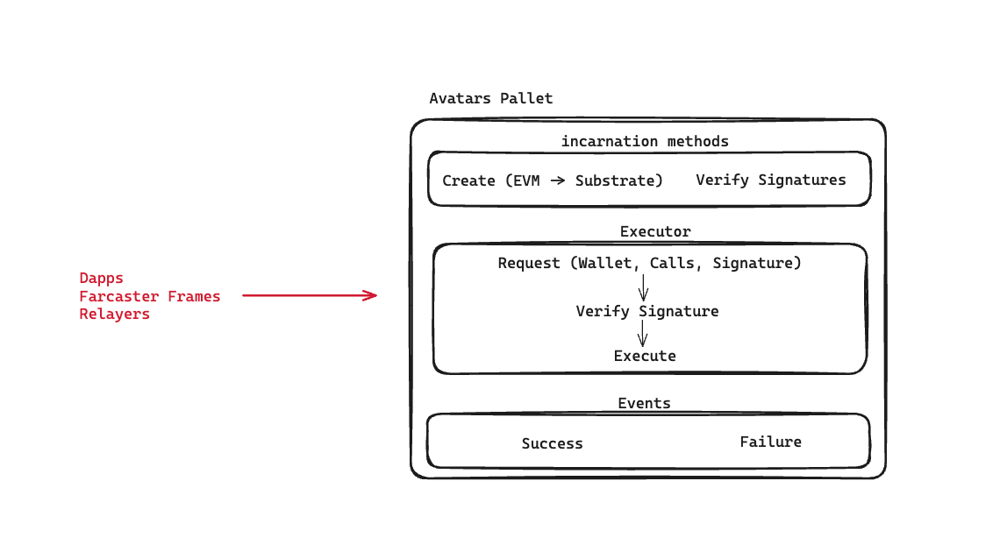
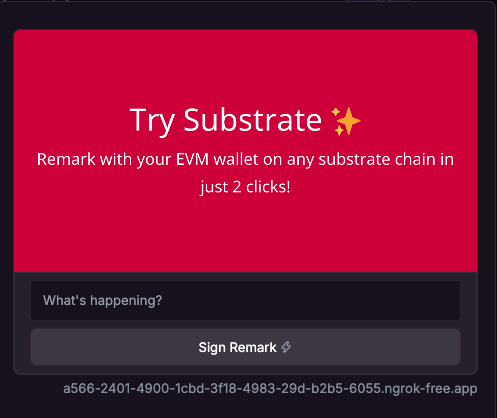

Demo Video: https://youtu.be/0VCW4UhYB2M

## Avatar Accounts

**Avatar Accounts** is a tool designed for Substrate-based chains, allowing Ethereum users to access and interact with their applications by simply signing a message.

It creates a keyless Substrate account that operates on Substrate chains, capable of executing any pallet extrinsic calls, while being entirely controlled by the Ethereum user’s externally owned account.

This innovation enables Ethereum users to effortlessly explore and utilize the unique features and capabilities of Substrate chains (Parachains) without any extra steps on their end.

### Category
Tooling: (Infrastructure) Polkadot ecological developer tools

## Problem
Polkadot despite being one of the most powerful stacks in the ecoystem is lacking a lot of users as compared to ethereum and other EVM-based chains. Major reason is that most users already have onboarded to wallets like Metamask (and are familiar with EVM EOAs) and these side chains.

On the other hand, Polkadot requires these ETH users to:
- Know & understand it's a little "different" account system
- Download wallet (if you google "Polkadot Wallet", Polkadot.js comes on the top :( )
- Maintaining the keys securely, navigating through parachains, etc. 

All in all, not the best experience.

## Existing Solutions
There are many existing solutions with different levels of pain & security concerns, like:
- Downloading new wallets like Nova, Talisman, Subwallet, etc. (Requires a little bit trust & learning curve)
- Rely on Social Auth (Not privacy preserving & not consistent across dapps)
- Or maybe, Not to try a polkadot dapp (easy but not a good solution for our ecosystem)

> Our Vision is to **enable these users** to **experience** polkadot apps with **ZERO** efforts required.

## Introducing Avatar Accounts Pallet

The Avatar Accounts pallet is a Substrate-based tool designed to enable Ethereum Users interact with Substrate chains seamlessly without needing to install additional software or download a new wallet.

Users with ethereum wallets can now natively call different pallet methods, even interact with XCM calls, and more by just signing the operation's hash that they want to do. 

## How It Works

1. **Keyless Substrate Account Creation**: 
   - The pallet creates a keyless Substrate account derived from the user's Ethereum (EVM) address. This account is used for making transaction calls on the Substrate chain.

2. **Transaction Processing**:
   - **Step 1**: A decentralized application (dapp) initiates a transaction by creating a vector of calls for the Substrate chain.
   - **Step 2**: This vector of calls is hashed using the Keccak-256 algorithm. The dapp also generates a typed data structure that the user needs to sign using their EVM-based wallet.
   - **Step 3**: The dapp sends the signed message and the calls vector to the pallet method.
   - **Step 4**: The pallet verifies the signature, nonce, and other parameters to ensure that the user intends to perform the action.

3. **Transaction Execution**:
   - The pallet then creates a keyless Substrate account associated with the EVM externally owned account (EOA).
   - It dispatches the calls from the newly created keyless Substrate account on behalf of the user.

## Key Features

- **Seamless Integration**: Users can interact with Substrate chains directly using their Ethereum wallets.
- **EIP721 Compliance**: Supports the latest Ethereum Improvement Proposals (EIPs) for signing typed data.
- **No Additional Setup**: Users do not need to install or configure a new wallet to interact with Substrate chains.

## Usage

1. **For Dapp Developers**: Implement the pallet to enable transactions from Ethereum-based wallets without requiring users to handle Substrate-specific setups.
2. **For Users**: Sign the typed data structure from your EVM wallet to authorize transactions on Substrate chains.

## Demo
To help visualise the User Experience this pallet can bring, checkout this simple demo of a farcaster frame (frames are micro apps that can be built into the farcaster social apps) that creates a keyless substrate account for the user with EVM EOA ( as farcaster only supports) and sends the transaction on-chain for a remarkWithEvent under system pallet.

|On-Chain Remark|Tx Confirmed|
|--|--|
|||

This is very important because:
- Farcaster has over 50K+ daily active crypto native users
- Ethereum-based dApps & chains gained 1M+ txs on-chain in days using frames
- People can try Polkadot Ecosystem without leaving it & later decide to transition fully
- With just 2 clicks any (multiple) txs on Polkadot & parachain can be executed

> Note: Farcaster frame is just one demo, the pallet can be utilised by any dapp i.e. full applications can also use it to onboard people from eth ecosystem to Polkadot.

Video: https://youtu.be/0VCW4UhYB2M

## About Me
I am Tushar Ojha, from India. PBA'4 Hong Kong graduate. Worked previously at Subsocial as DevEx and researched on improving the user experience for the people & devs on Polkadot Ecosystem.

x.com/techtusharojha
