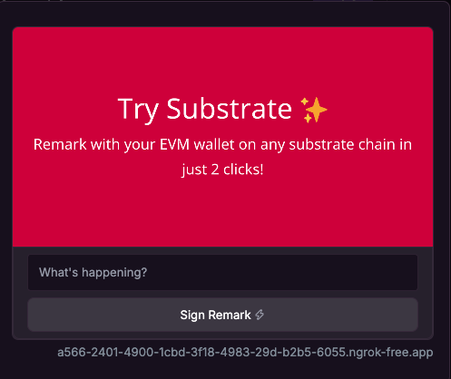
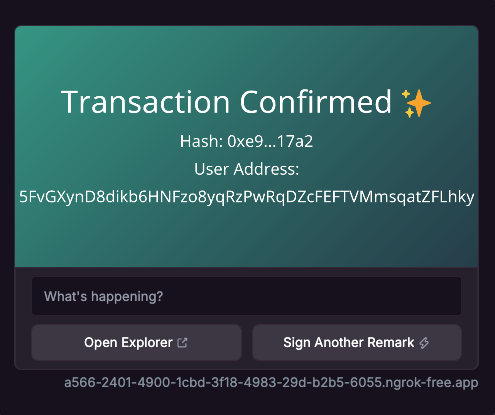

## Avatar Frame
The Avatar Frame is a straightforward [`farcaster frame`](https://docs.farcaster.xyz/developers/frames/) demonstrating the use of the [Avatar Accounts pallet](https://github.com/tusharojha/avatar-accounts-pallet). It allows Ethereum users to interact with Substrate-based chains with just a few clicks.

Frames have become popular in the Ethereum ecosystem as the social media platform Farcaster grows. Historically, nearly all traffic (i.e., transactions) was directed to Ethereum-based chains, as Farcaster natively supports only EVM wallets. However, this Avatar Frame represents a trustless, non-custodial implementation that facilitates transactions directly from users to Substrate chains. This approach enhances transaction volume in the Polkadot ecosystem while providing users with a better experience and more advanced dApps.

## UX Preview
|On-Chain Remark|Tx Confirmed|
|--|--|
|||

```
npm install
npm run dev
```

Head to http://localhost:5173/api